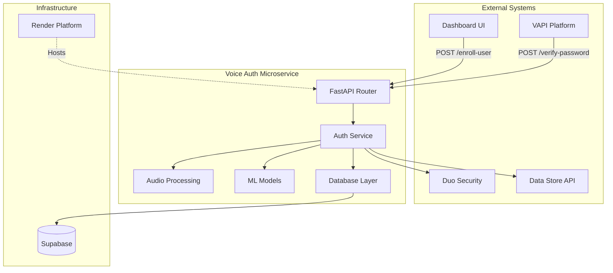
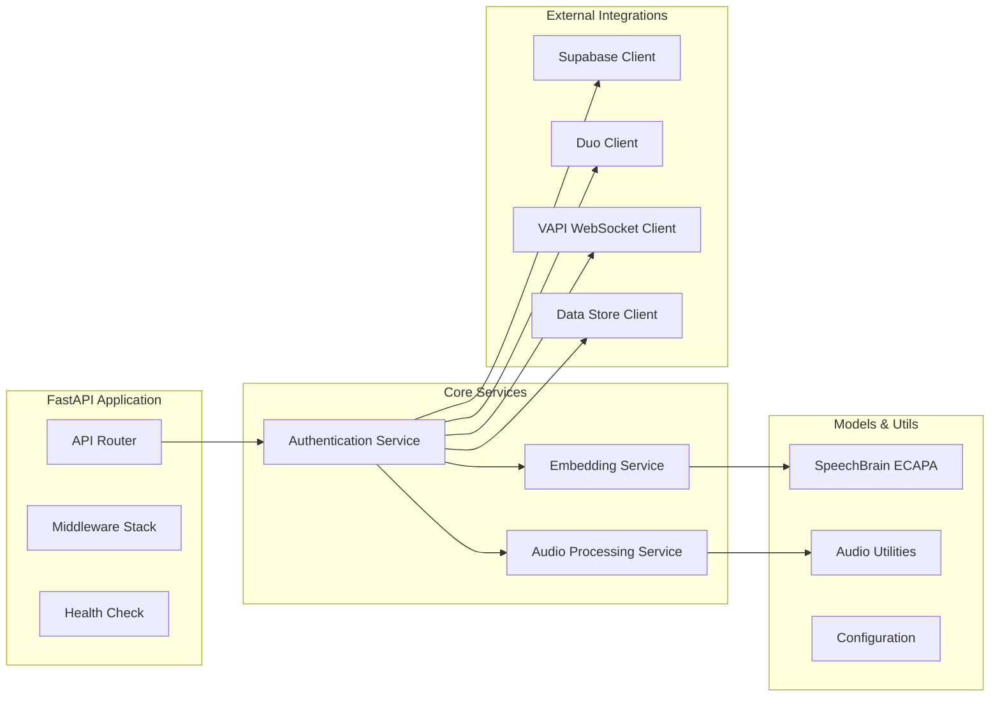

# Design Document

## Overview

The voice authentication microservice is a FastAPI-based application that provides secure speaker enrollment and verification capabilities. The service integrates multiple technologies: SpeechBrain ECAPA-TDNN for speaker recognition, Supabase for data persistence, VAPI WebSocket integration for live audio capture, and Duo Security for multi-factor authentication.

The architecture follows a layered approach with clear separation of concerns:
- **API Layer**: FastAPI endpoints with request/response handling
- **Business Logic Layer**: Authentication workflows and audio processing
- **Integration Layer**: External service connectors (Supabase, Duo, VAPI)
- **Data Layer**: Database models and repository patterns

## Architecture

### System Architecture



### Component Architecture



## Components and Interfaces

### API Layer

**FastAPI Application (`src/main.py`)**
- Handles HTTP requests and responses
- Implements middleware for logging, CORS, and error handling
- Provides OpenAPI documentation
- Manages application lifecycle and graceful shutdown

**Endpoints:**
```python
@app.post("/enroll-user")
async def enroll_user(request: EnrollmentRequest) -> EnrollmentResponse

@app.post("/verify-password") 
async def verify_password(request: VerificationRequest) -> VerificationResponse

@app.get("/healthz")
async def health_check() -> HealthResponse
```

### Business Logic Layer

**Authentication Service (`src/services/auth_service.py`)**
- Orchestrates enrollment and verification workflows
- Manages business rules and validation
- Coordinates between audio processing, ML models, and external services

**Audio Processing Service (`src/services/audio_service.py`)**
- Downloads audio files from URLs
- Converts audio formats using ffmpeg
- Handles WebSocket audio streaming from VAPI
- Implements silence detection and buffering

**Embedding Service (`src/services/embedding_service.py`)**
- Manages SpeechBrain ECAPA model lifecycle
- Generates speaker embeddings from audio
- Computes cosine similarity scores
- Handles model caching and optimization

### Integration Layer

**Supabase Client (`src/clients/supabase_client.py`)**
- Manages database connections and operations using public anon key
- Implements repository pattern for users and auth_attempts
- Handles connection pooling and retry logic
- Uses direct database access without RLS (Row Level Security)

**Duo Client (`src/clients/duo_client.py`)**
- Integrates with Duo Security API
- Manages push notifications and polling
- Handles authentication timeouts and errors

**VAPI Client (`src/clients/vapi_client.py`)**
- Manages WebSocket connections to VAPI listen URLs
- Handles PCM audio stream processing
- Implements connection lifecycle management

**Data Store Client (`src/clients/data_client.py`)**
- Fetches user records from external data API
- Handles HTTP client operations with retry logic

### Utility Layer

**Audio Utilities (`src/utils/audio_utils.py`)**
- Audio format conversion functions
- PCM to WAV conversion utilities
- Audio validation and preprocessing
- Silence detection algorithms

**Configuration (`src/config.py`)**
- Environment variable management
- Application settings and defaults
- Validation of required configuration

## Data Models

### Database Schema

**Users Table:**
```sql
CREATE TABLE users (
    id UUID PRIMARY KEY,
    phone TEXT UNIQUE NOT NULL,
    embedding FLOAT8[192] NOT NULL,
    enrolled_at TIMESTAMPTZ DEFAULT NOW()
);

CREATE INDEX idx_users_phone ON users(phone);

-- Disable RLS for direct access
ALTER TABLE users DISABLE ROW LEVEL SECURITY;
```

**Auth Attempts Table:**
```sql
CREATE TABLE auth_attempts (
    id BIGSERIAL PRIMARY KEY,
    user_id UUID REFERENCES users(id),
    success BOOLEAN NOT NULL,
    score FLOAT8,
    created_at TIMESTAMPTZ DEFAULT NOW()
);

CREATE INDEX idx_auth_attempts_user_id ON auth_attempts(user_id);
CREATE INDEX idx_auth_attempts_created_at ON auth_attempts(created_at);

-- Disable RLS for direct access
ALTER TABLE auth_attempts DISABLE ROW LEVEL SECURITY;
```

### API Models

**Request/Response Models:**
```python
class EnrollmentRequest(BaseModel):
    userId: UUID
    phone: str
    audioUrl: str

class EnrollmentResponse(BaseModel):
    status: str
    score: float

class VerificationRequest(BaseModel):
    userId: UUID
    listenUrl: str

class VerificationResponse(BaseModel):
    success: bool
    message: str
    records: Optional[List[Dict]] = None
    score: Optional[float] = None
```

### Internal Models

**User Model:**
```python
@dataclass
class User:
    id: UUID
    phone: str
    embedding: np.ndarray
    enrolled_at: datetime
```

**Auth Attempt Model:**
```python
@dataclass
class AuthAttempt:
    user_id: UUID
    success: bool
    score: Optional[float]
    created_at: datetime
```

## Error Handling

### Error Categories

1. **Client Errors (4xx)**
   - Invalid request format
   - Missing required fields
   - Audio download failures
   - User not found

2. **Server Errors (5xx)**
   - Database connection failures
   - Model loading errors
   - External service timeouts
   - Internal processing errors

### Error Response Format

```python
class ErrorResponse(BaseModel):
    error: str
    message: str
    correlation_id: str
    timestamp: datetime
```

### Retry Strategy

- **Database Operations**: Exponential backoff, max 3 retries
- **External API Calls**: Linear backoff, max 2 retries
- **Audio Downloads**: Single retry with different timeout
- **WebSocket Connections**: Immediate failure, no retry

### Circuit Breaker Pattern

Implement circuit breakers for:
- Duo API calls (5 failures in 60 seconds)
- Data Store API calls (3 failures in 30 seconds)
- Supabase connections (10 failures in 120 seconds)

## Testing Strategy

### Unit Testing

**Coverage Requirements:**
- Minimum 90% code coverage
- All business logic functions tested
- Edge cases and error conditions covered
- Mock external dependencies

**Test Structure:**
```
tests/
├── unit/
│   ├── test_auth_service.py
│   ├── test_audio_service.py
│   ├── test_embedding_service.py
│   └── test_audio_utils.py
├── integration/
│   ├── test_api_endpoints.py
│   ├── test_database_operations.py
│   └── test_external_integrations.py
└── e2e/
    ├── test_enrollment_flow.py
    └── test_verification_flow.py
```

### Integration Testing

**Test Containers:**
- Supabase/PostgreSQL container for database tests
- Mock servers for Duo, VAPI, and Data Store APIs
- Redis container for caching tests

**Test Scenarios:**
- Complete enrollment workflow
- Complete verification workflow
- Error handling and recovery
- Performance under load

### End-to-End Testing

**Test Environment:**
- Deployed service on Render staging
- Real Supabase instance
- Mock external services
- Automated test suite in CI/CD

### Performance Testing

**Load Testing:**
- 100 concurrent enrollment requests
- 50 concurrent verification requests
- Memory usage under sustained load
- Model inference latency benchmarks

## Deployment Architecture

### Render Configuration

**Service Configuration:**
```yaml
# render.yaml
services:
  - type: web
    name: voice-auth-microservice
    env: python
    buildCommand: pip install -r requirements.txt
    startCommand: uvicorn src.main:app --host 0.0.0.0 --port $PORT
    envVars:
      - key: PYTHON_VERSION
        value: 3.11
      - key: SUPABASE_URL
        sync: false
      - key: SUPABASE_ANON_KEY
        sync: false
      - key: DUO_HOST
        sync: false
      - key: DUO_IKEY
        sync: false
      - key: DUO_SKEY
        sync: false
      - key: DATA_URL
        sync: false
      - key: VOICE_THRESHOLD
        value: "0.82"
```

### Docker Configuration

**Multi-stage Dockerfile:**
```dockerfile
# Build stage
FROM python:3.11-slim as builder
WORKDIR /app
COPY requirements.txt .
RUN pip install --no-cache-dir -r requirements.txt

# Runtime stage
FROM python:3.11-slim
WORKDIR /app
COPY --from=builder /usr/local/lib/python3.11/site-packages /usr/local/lib/python3.11/site-packages
COPY src/ ./src/
EXPOSE 8000
CMD ["uvicorn", "src.main:app", "--host", "0.0.0.0", "--port", "8000"]
```

### Environment Variables

**Required Configuration:**
- `SUPABASE_URL`: Supabase project URL
- `SUPABASE_ANON_KEY`: Supabase anonymous/public key for database access
- `DUO_HOST`: Duo Security API hostname
- `DUO_IKEY`: Duo integration key
- `DUO_SKEY`: Duo secret key
- `DATA_URL`: Base URL for user data API
- `PORT`: Server port (provided by Render)

**Optional Configuration:**
- `VOICE_THRESHOLD`: Similarity threshold (default: 0.82)
- `LOG_LEVEL`: Logging level (default: INFO)
- `MAX_AUDIO_DURATION`: Maximum audio length in seconds (default: 30)
- `WEBSOCKET_TIMEOUT`: WebSocket connection timeout (default: 65)

### Observability

**Structured Logging:**
- JSON formatted logs with correlation IDs
- Request/response logging with sanitized data
- Error tracking with stack traces
- Performance metrics logging

**OpenTelemetry Integration:**
- Distributed tracing for request flows
- Custom metrics for business operations
- Integration with Render's monitoring
- Export to external observability platforms

**Health Monitoring:**
- Liveness probe at `/healthz`
- Database connection health checks
- External service dependency checks
- Model loading status verification